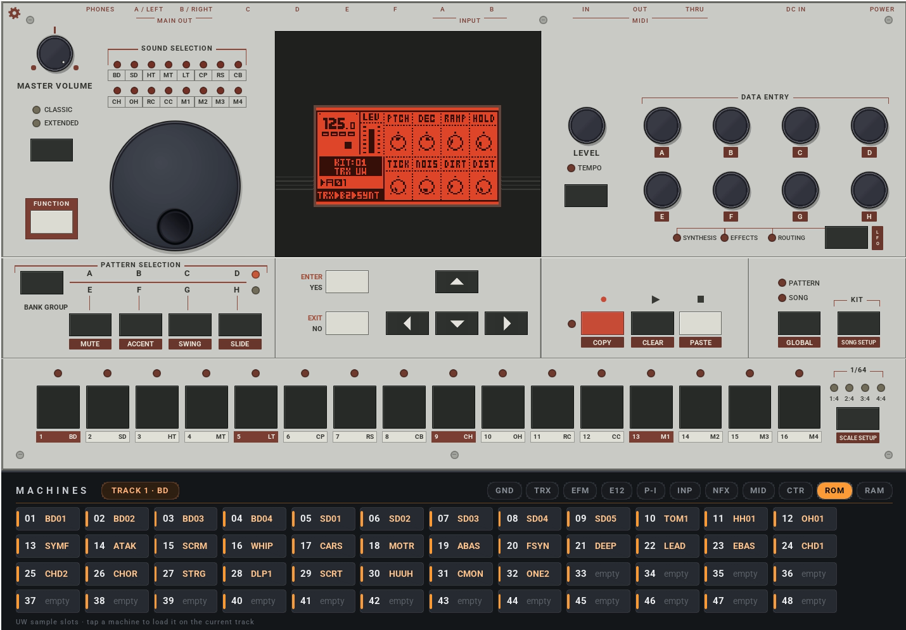
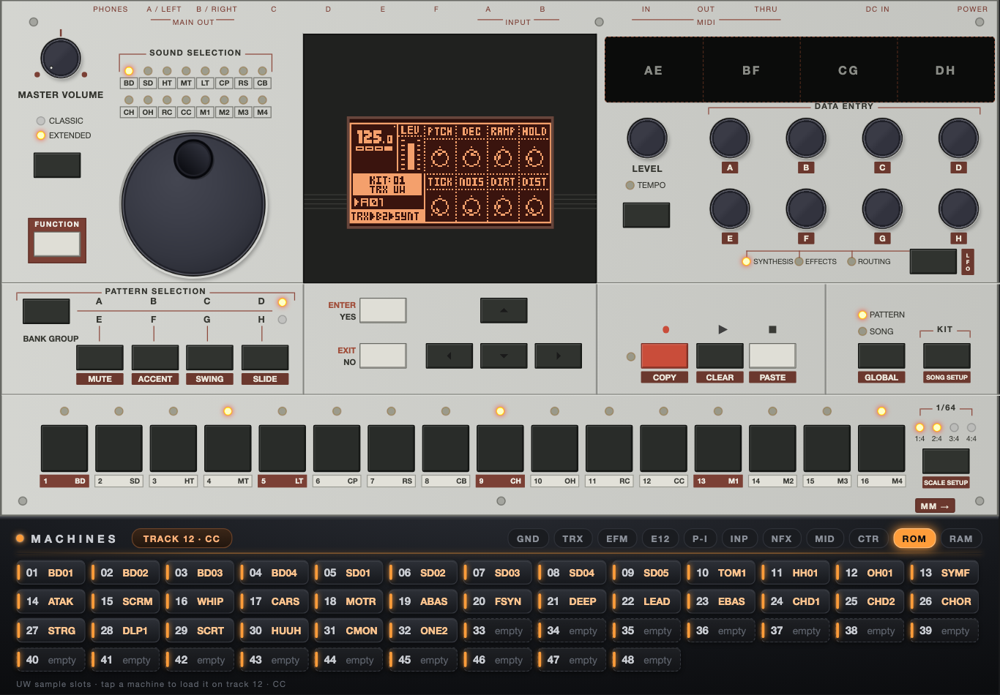
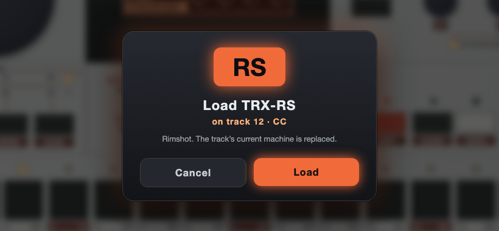

# Machinedrum & Monomachine plugins: iPad panel, machine rack, samples, community firmware

Emulations of the **Elektron Machinedrum UW** and **Monomachine SFX-60** as VST3, AU and CLAP plugins, running the
original firmware. This branch builds on [joelanders/gearmulator-md-mm](https://github.com/joelanders/gearmulator-md-mm)
(itself based on TUS's [Gearmulator](https://github.com/dsp56300/gearmulator)) and adds five things:

| | What it does |
|---|---|
| **1. Third-party firmware** | Run Machinedrum **OS X.13** or Monomachine **X.01A / EMS** per plugin instance, saved with the project. |
| **2. Sample management** | Drag WAV/AIFF files from Finder or your DAW onto the Machinedrum and pick UW slots from the live sample list. |
| **3. iPad control** | Every instance serves its full front panel to an iPad or any browser on your network, multitouch and in sync. |
| **4. XY multitouch pad** | Four touch zones (AE, BF, CG, DH) control two DATA ENTRY encoders per finger. |
| **5. Direct machine changing** | A machine rack under the panel: tap a machine, confirm, it loads on the current track. |

Full details, usage and implementation notes: **[ADDITIONS.md](ADDITIONS.md)**.

> **No firmware is included.** The emulator runs Elektron's firmware, which is copyrighted. You need your own
> Machinedrum UW and Monomachine SFX-60 flash images. Please do not ask anyone for them.



*The Machinedrum plugin. The machine rack below the faceplate shows the ROM machines labelled with the samples that are
actually in the machine's UW slots.*

---

## 1. Third-party firmware

- Load community OS builds such as **Machinedrum X.13** and **Monomachine X.01A** from
  [jmamma/MCL](https://github.com/jmamma/MCL/releases), or the **EMS** Monomachine firmware from
  [emuyia/ems-monomachine-firmware](https://github.com/emuyia/ems-monomachine-firmware).
- Choose the image with the **gear icon** on the faceplate, section *Firmware*. Each instance can run a different OS.
- The choice is the default for new instances and is **stored in the project**, so a song reopens on the OS it was made with.
- A script converts an OS upgrade `.syx` into a flash image using your stock image.
- Includes a fix for clicks and aliasing on X.13, caused by voice data being dropped between the two emulated DSPs.

## 2. Sample management

- **Drop audio files** anywhere on the Machinedrum panel, from Finder or straight from your DAW, or use
  *Load Samples* in the right-click menu.
- The slot menu shows the **real contents** of all 48 UW slots (name, length, sample rate) and pre-selects free slots.
  Occupied slots are only replaced after confirmation, and free sample memory is checked first.
- Files are converted to 16-bit mono and sent over MIDI Sample Dump, keeping their sample rate.
- Dropping a `.syx` file sends it to either machine.

## 3. iPad and browser control



- Open the address in `remote-panel-url.txt` (data folder) on an iPad on the same network. The Machinedrum uses port
  **8790**, the Monomachine **8792**, so both can be open at once. *Add to Home Screen* gives a full-screen panel.
- Live LCD and LEDs. Plugin window, machine and every connected browser stay in sync.
- **Multitouch:** hold a trig and turn an encoder for parameter locks, hold FUNCTION plus a key, turn the sound
  selection wheel with a finger.
- Dedicated Monomachine page. Switch between the two machines with the MD/MM button or a four-finger swipe.

> The panel has no password. Use it on a trusted local network only.

## 4. XY multitouch pad

- The black strip above DATA ENTRY is split into four zones: **AE, BF, CG, DH**.
- A finger that lands in a zone turns that zone's top encoder left/right and its bottom encoder up/down, and keeps
  that pair while it moves.
- Four fingers in four zones control all eight encoders at once.

## 5. Direct machine changing



- Family tabs (GND, TRX, EFM, E12, P-I, INP, NFX, MID, CTR, ROM, RAM on the Machinedrum; GND, SWAVE, SID, DPRO, FM+, VO,
  FX on the Monomachine) with a tile per machine.
- A badge follows the machine's **current track**. Tap a tile, confirm, and the machine is loaded on that track.
- Works in the plugin window and on the iPad. Machines that only exist on community OS builds appear when one is running.

---

## Also in this branch

- Everything from the base project: key chording and parameter locks with the mouse, encoder push, SysEx file
  transfer, host audio input, multiple outputs. See [README.base.md](README.base.md).
- **DAW sync:** sample-accurate MIDI clock, start, continue and stop from the host. On the Machinedrum set
  GLOBAL > SYNC > TEMPO IN to EXTERNAL.
- **DSP56300 emulator fixes** (JIT and interpreter) found while emulating other hardware.
- FUNCTION is momentary on the iPad, as on the hardware.
- Tests for sample transfer, firmware selection and state restore, plus diagnostic tools. See ADDITIONS.md.

## Getting it

There are no prebuilt downloads yet. Build from source on macOS:

```bash
git clone --recursive -b md-mm-remote-panel https://github.com/helica1/gearmulator.git
cd gearmulator
cmake -G Ninja -B build_plugin -DCMAKE_BUILD_TYPE=Release \
    -Dgearmulator_SYNTH_ELEKTRON=ON -Dgearmulator_BUILD_JUCEPLUGIN=ON \
    -Dgearmulator_BUILD_JUCEPLUGIN_CLAP=ON -Dgearmulator_BUILD_JUCEPLUGIN_AU=ON .
ninja -C build_plugin mdJucePlugin_All mdJucePlugin_CLAP mmJucePlugin_All mmJucePlugin_CLAP
```

- Plugins land in `bin/plugins/Release/{VST3,CLAP,AU}`. Copy them to `~/Library/Audio/Plug-Ins/{VST3,CLAP,Components}`
  and restart the DAW.
- Put your stock firmware images into `~/Documents/Gearmulator Preview/Machinedrum/roms/` and
  `.../Monomachine/roms/`, community OS images into the `alt/` subfolder.
- The plugins are not notarized. If you copy a built plugin to another Mac, remove the quarantine flag there:

```bash
xattr -dr com.apple.quarantine ~/Library/Audio/Plug-Ins/VST3/"Gearmulator MD.vst3"
```

Developed and tested on macOS with Apple Silicon in Bitwig Studio. Other platforms have not been tried with these changes.

## Credits

- **Joe Landers**: the Machinedrum and Monomachine emulation this branch is built on,
  [joelanders/gearmulator-md-mm](https://github.com/joelanders/gearmulator-md-mm). Original README:
  [README.base.md](README.base.md).
- **TUS and the Gearmulator contributors**: the emulation framework and DSP56300 emulator,
  [dsp56300/gearmulator](https://github.com/dsp56300/gearmulator). Original README: [README.upstream.md](README.upstream.md).
- **jmamma (MCL)** and **emuyia (EMS)** for the community operating systems.

This branch is not affiliated with Elektron, TUS or Joe Landers. Please don't ask them for support with it.
Licensed under GPLv3 like the projects it is based on.
